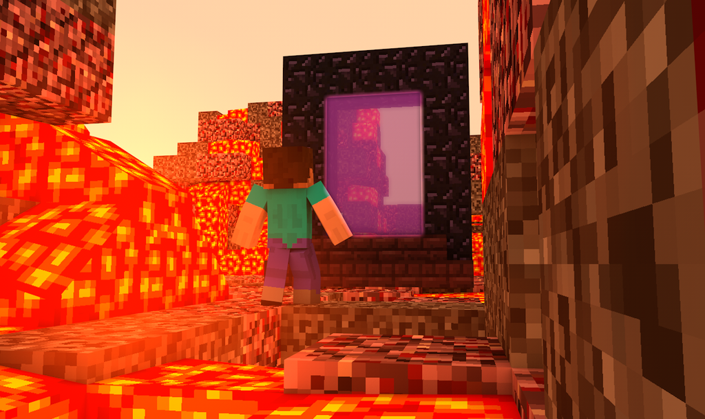

# Recipe for disaster

---

## Benodigdheden

* Ketel
  * Een gietijzeren ketel werkt het beste.
* 3 baby tranen
* Een sleutel voor een portaal naar de hel
* Een geit

---

## Instructies

1. Steek een vuur onder de ketel aan:
   1. Knip wat geitenharen af en steek aan met vuursteen;
   2. Leg bij de stookplek.

2. Vul de ketel tot de helft met water.
3. Laat het water een temperatuur van _66 graden Celsius_ bereiken.
4. Laat 3 baby tranen met een interval van 10 seconden in de ketel vallen. Doe dat van een hoogte van _55 centimeter_.
5. Laat de geit geluid maken **boven** de ketel.
6. Een sleutelgat-vormige draaikolk zal zich na **2-5 minuten** vormen in het brouwsel. Stop hier de hel sleutel in
7. Geniet van de chaos!

---

### Affiliate links

* [Ketel](https://www.amazon.com/Cauldron-Handle-Smudging-Blessings-Incense/dp/B091G4JQXN/ref=sr_1_1_sspa?dchild=1&keywords=cauldron&qid=1632739892&sr=8-1-spons&psc=1&spLa=ZW5jcnlwdGVkUXVhbGlmaWVyPUEyNE8zNThDWlZWSFRRJmVuY3J5cHRlZElkPUEwNzkyMjQzMllWVk9UT1o5VzFVJmVuY3J5cHRlZEFkSWQ9QTEwMTExODUzRDQyUDA2SldLNlJYJndpZGdldE5hbWU9c3BfYXRmJmFjdGlvbj1jbGlja1JlZGlyZWN0JmRvTm90TG9nQ2xpY2s9dHJ1ZQ==) (Amazon)
* [Baby's](https://www.amsterdam.nl/stadsarchief/stukken/zorg/burgerweeshuis/) (Gemeente Amsterdam)
* [Sleutel naar de hel](https://www.amazon.nl/Premium-Tesla-Cover-voor-Model/dp/B081S5HBBK/ref=sr_1_1_sspa?__mk_nl_NL=%C3%85M%C3%85%C5%BD%C3%95%C3%91&crid=17XGPVBMGGZQZ&dchild=1&keywords=tesla+key+fob&qid=1632740008&sprefix=tesla+key%2Caps%2C160&sr=8-1-spons&psc=1&spLa=ZW5jcnlwdGVkUXVhbGlmaWVyPUExRFFONUM2Qlk3T01OJmVuY3J5cHRlZElkPUEwNDAxNDU1VEtGNFQ1Q09BNDk2JmVuY3J5cHRlZEFkSWQ9QTEwNDU3NzgzT1lWM0ZHWlBJOEk0JndpZGdldE5hbWU9c3BfYXRmJmFjdGlvbj1jbGlja1JlZGlyZWN0JmRvTm90TG9nQ2xpY2s9dHJ1ZQ==) (Amazon)
* [Geit](https://www.marktplaats.nl/l/dieren-en-toebehoren/schapen-geiten-en-varkens/q/dwerggeit/) (Marktplaats)
